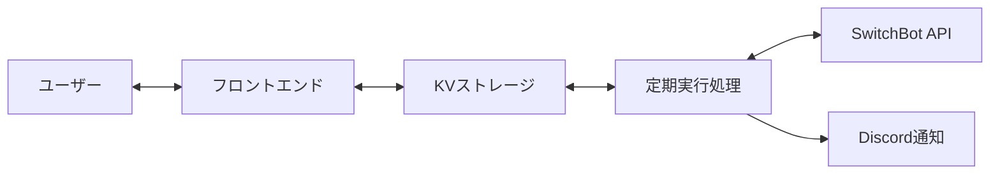

# エアコン自動制御システム 基本設計

## システム全体構成

### アーキテクチャ概要

#### 主要コンポーネント

- **フロントエンド**: React Router（Cloudflare Pages）
- **定期実行**: Cloudflare Workers（15分間隔）
- **データ保存**: Cloudflare KV
- **外部連携**: SwitchBot API、Discord Webhook

### データフロー

1. **設定フロー**: ユーザー → フロントエンド → KV（即座反映）
2. **制御フロー**: 定期実行 → KV読取 → SwitchBot API → 結果をKV保存
3. **監視フロー**: フロントエンド → KV読取 → 状態表示

## データ設計

### 保存するデータ種別

### スケジュールデータ

- デフォルトスケジュール（帰宅時刻、有効/無効）
- 特定日スケジュール（日付別の個別設定）

### システム設定

- システム全体の有効/無効状態（現在は環境変数管理）

### 履歴・状態データ

- 実行履歴（日時、結果、温度情報、エラー）
- 現在状態（最終実行時刻、次回予定、現在温度）

### KVストレージ設計

データはキー・バリュー形式で保存し、フロントエンドから直接読み書きする設計とする。キーは機能別に分類し、効率的なアクセスを可能にする。

## 機能設計

### フロントエンド機能群

#### ダッシュボード

- 現在温度・システム状態の表示
- 次回実行予定と最新結果の確認

#### スケジュール管理

- デフォルト設定（基本的な帰宅時刻）
- カレンダー形式での特定日設定
- 設定の有効/無効切り替え

#### システム管理

- システム全体の有効/無効切り替え
- 実行履歴の閲覧

### バックエンド処理

#### 定期実行ロジック

1. 現在時刻でのスケジュール判定
2. 温度測定とターゲット温度計算
3. エアコン制御実行
4. 結果記録と通知

#### 制御判定アルゴリズム

- スケジュール設定に基づく実行時刻判定
- 現在温度と設定範囲の比較

## 運用設計

### エラー対応方針

#### API障害対応

- SwitchBot API接続エラー時はエラーログ出力のみ
- 得られた温度データをそのまま使用

#### データ整合性

- KVアクセスエラー時のフォールバック
- 設定データの妥当性チェック
- 履歴データの定期クリーンアップ

### セキュリティ考慮

#### APIキー管理

- 環境変数による秘匿情報管理
- フロントエンドからの直接API呼び出し制限

#### アクセス制御

- フロントエンドの認証不要設計（プライベート利用想定）
- Workers実行権限の最小化

## システム制約・前提

### 技術制約

- Cloudflare KVの読み書き制限
- Workers実行時間制限
- SwitchBot API呼び出し頻度制限

### 運用前提

- 個人利用での小規模運用
- 24時間稼働での安定性重視
- シンプルな設定での使いやすさ重視
